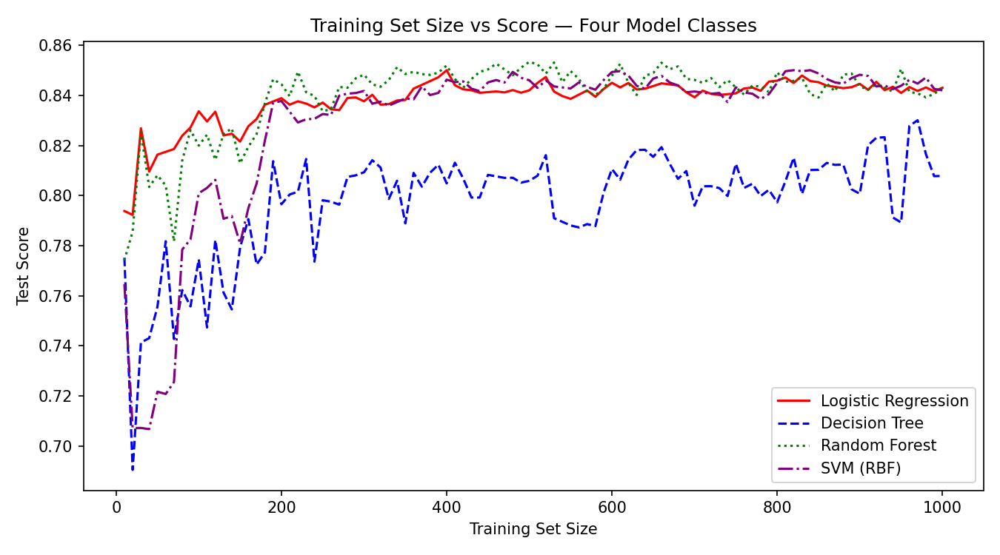

# Lab 1 Written Responses

## Question 1: Assumptions About Training Data

**Assumptions we make:**

- **i.i.d. (independent and identically distributed):** We assume training examples are drawn independently from the same underlying distribution. This lets us treat each sample equally when computing loss.
- **Representative sampling:** We assume the training set reflects the true distribution of the real world — that the data we have covers the kinds of inputs the model will encounter at deployment.
- **Label correctness:** We assume the labels (ground truth) are accurate and not systematically mislabeled.
- **Feature relevance:** We assume the input features we provide contain signal relevant to predicting the target variable.

**Things we should NOT assume:**

- **The training distribution equals the deployment distribution:** The real world can shift over time or across populations (distribution shift / covariate shift). A model trained on historical crime data may not generalize to future demographics.
- **No selection bias:** We should not assume the data was collected without bias. In the Communities and Crime dataset, certain communities may be overrepresented or underrepresented, skewing what the model learns.
- **All subgroups are equally represented:** Minority subgroups (e.g., communities with smaller populations) may have too few samples for the model to learn accurate patterns for them, even if overall accuracy looks fine.
- **Correlation implies causation:** A feature that correlates with the label in training data does not necessarily cause the outcome — assuming so can lead to harmful or spurious model behavior.

---

## Question 2: Evaluating on Held-Out Test Data

Evaluating on data not used in training is critical because training measures how well the model memorized the training set, not how well it generalizes. A model that has simply memorized its training data will perform perfectly on it but fail on new inputs — this is called **overfitting**.

By holding out a test set, we get an honest estimate of how the model will perform in the real world, where it encounters unseen examples.

**Why train and test error rates differ:**

The model is directly optimized on the training data, so it adapts to that specific sample — including its noise and idiosyncrasies. The test set contains different samples drawn from the same (or similar) distribution, so any patterns the model overfit to will not transfer. This gap between train and test error is the hallmark of overfitting, and it grows as model complexity increases.

---

## Question 3: Task 4.A — Training Set Size vs. Score

The plot shows how model score (accuracy) changes as the training set size increases, for both Logistic Regression (solid red) and Decision Trees (dashed blue), evaluated on a fixed test set.

**Observations:**
- Logistic Regression starts relatively high (~0.80) even with very few training examples and quickly stabilizes around 0.84–0.85 as more data is added.
- Decision Trees start very low (~0.67) with small training sets and are much more volatile, with large swings in accuracy before gradually trending upward toward ~0.81–0.83.

**Why this makes sense:**

Logistic Regression is a simpler, lower-variance model with fewer parameters. It does not need a large dataset to find a stable decision boundary, so it performs reasonably well even on small training sets. Decision Trees, by contrast, are high-variance models that try to memorize training examples through branching rules. With very few samples, they build unstable trees that don't generalize well. As training size grows, both models improve, but Decision Trees remain noisier and converge to a lower test accuracy — suggesting they overfit more even with more data.

---

## Question 4: Task 4.B — Max Depth vs. Score

The plot shows a Decision Tree's training score (solid green) and test score (dashed blue) as the maximum tree depth increases from 1 to 20.

**Observations:**
- Training score climbs steeply from ~0.845 at depth 1 up to ~1.00 at depth 12+, where it essentially memorizes the training data perfectly.
- Test score stays nearly flat around 0.80–0.82 throughout, and slightly decreases at higher depths.

**Why this makes sense:**

This is a textbook illustration of overfitting. A shallow tree is too simple (underfitting) — it cannot capture all the structure in the data, so both train and test scores are modest. As depth increases, the tree gains the capacity to fit increasingly fine-grained patterns in the training data, eventually memorizing individual training examples (training score → 1.0). However, those memorized patterns are noise-specific to the training set and do not generalize, so test score does not improve — it actually slightly declines. The growing gap between the two curves as depth increases is exactly the train/test error gap described in Question 2.

---

## Question 5: Task 5 — Sorted Disparities

The sorted disparity table shows the **score disparity, false negative rate (FNR) disparity, and false positive rate (FPR) disparity** for four racial demographic features — `racePctAsian`, `racePctHisp`, `racePctWhite`, and `racepctblack`:

| column        | Score Disparity | FNR Disparity | FPR Disparity |
|---------------|-----------------|---------------|---------------|
| racePctAsian  | 0.0320          | 0.0800        | 0.0203        |
| racePctHisp   | 0.1694          | 0.0547        | 0.2143        |
| racePctWhite  | 0.1836          | 0.7025        | 0.4005        |
| racepctblack  | 0.1365          | 0.4391        | 0.3491        |

**What this means:**

Each row splits communities into two groups — those with a high vs. low proportion of that racial group — and measures how differently the model performs on each group. A higher disparity means the model makes substantially different types of errors depending on the demographic composition of the community.

- `racePctAsian` has the lowest disparities overall, suggesting the model performs more consistently across communities regardless of their Asian population share.
- `racePctWhite` has the highest FNR disparity (0.7025), meaning the model is far more likely to produce false negatives (predicting "low crime" when the true label is "high crime") in communities with a low white population proportion vs. a high one — or vice versa.
- `racepctblack` has large FNR (0.4391) and FPR (0.3491) disparities, meaning the model's error patterns differ significantly between communities with high and low Black population shares.

**Implications for unfairness:**

A high FNR disparity on `racepctblack` means the model may systematically under-predict crime in communities it associates with certain racial compositions, potentially under-allocating resources (e.g., police, social services) to those areas. Conversely, a high FPR means over-predicting crime, which can lead to over-policing and harms to residents. These disparities suggest the model encodes racial correlations in ways that produce structurally unequal outcomes — a serious fairness concern in any real-world deployment of such a system.

---

## Question 6: Expected Error Disparity by Feature

**Features expected to have HIGH error disparity:**

1. **`racepctblack`** — As seen in the results, this feature has large FNR and FPR disparities. Communities differ significantly in socioeconomic conditions that correlate with race due to historical inequities, and a model trained on such data tends to learn these correlations, producing systematically different errors across demographic groups.
2. **`PctIlleg` (percentage of kids born to never-married parents)** — This feature is likely to be a proxy for socioeconomic inequality and correlates strongly with racial composition due to structural factors. Models using this feature could produce disparate error rates between communities with different demographic makeups.

**Features expected to have LOW error disparity:**

1. **`PolicOperBudg` (police operational budget)** — This is a fairly direct structural feature of how much a community invests in policing. It is less likely to correlate strongly with a specific demographic split and more likely to reflect policy decisions uniformly across groups.
2. **`LemasPctOfficDrugUn` (percent of officers assigned to drug units)** — This is a narrow, operationally-specific feature. While policing patterns can carry bias, this particular feature measures department structure rather than population characteristics, so it may produce more uniform error rates across demographic splits.

---

## Extra Credit: Comparing Four Model Classes

**Plot:** `results/extra-credit.png`

**Process:** I extended the Task 4.A experiment to include two additional classifiers — a **Random Forest** (50 estimators, max depth 5) and an **SVM with an RBF kernel** — alongside the original Logistic Regression and Decision Tree. All four models were trained on increasing training set sizes from 10 to 1000, and test score was recorded at each step.

**Results (average test score over the final 100 training sizes):**

| Model              | Avg Test Score |
|--------------------|----------------|
| Logistic Regression | 0.8382        |
| Decision Tree       | 0.7976        |
| Random Forest       | 0.8398        |
| SVM (RBF)           | 0.8292        |

**Analysis:**

The most striking finding is that **Random Forest and Logistic Regression converge to nearly identical plateau scores (~0.84)**, with Random Forest having slightly higher peak accuracy in the mid-range (200–600 training examples). This makes sense: Random Forest is an ensemble of many decision trees, which cancels out the high variance that hurts a single Decision Tree. By averaging over many trees, the ensemble achieves the stability of a simpler model while retaining more expressive power.

The **single Decision Tree remains the worst performer**, staying ~4–5 points below the others at convergence with persistent volatility — consistent with what we saw in Task 4.A. This confirms the bias-variance tradeoff: without depth restriction or ensembling, a single tree struggles to generalize stably.

**SVM (RBF)** starts very low with small training sets (it requires more data to place its support vectors well) but climbs quickly after ~200 samples and converges just below Logistic Regression. This suggests the decision boundary for this dataset is close to linearly separable — the RBF kernel doesn't provide much advantage over Logistic Regression here, and the added complexity comes at a cost in data efficiency.

Overall, this suggests that for this dataset and scale, **Logistic Regression is hard to beat** — it's fast, stable, and achieves near-optimal accuracy. The Random Forest matches it but at significantly higher computational cost. If deploying a model for a task like this, Logistic Regression would be the most practical choice.
