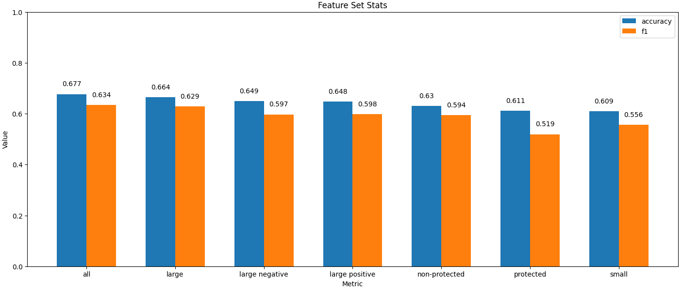
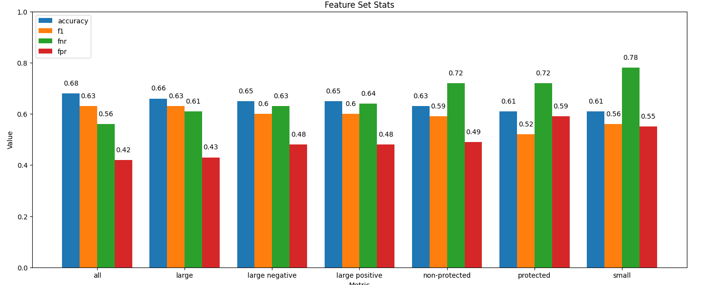

[2]
Juvenile felony count = 0	Juvenile felony count = 1	Juvenile felony count = 2	Juvenile felony count >= 3	Juvenile misdemeanor count = 0	Juvenile misdemeanor count = 1	Juvenile misdemeanor count = 2	Juvenile misdemeanor count >= 3	Juvenile other offense count = 0	Juvenile other offense count = 1	...	Age > 45	Gender = Female	Gender = Male	Race = Other	Race = Asian	Race = Native American	Race = Caucasian	Race = Hispanic	Race = African American	Recidivate
0	1	0	0	0	1	0	0	0	1	0	...	0	0	1	0	0	0	0	0	1	1
1	1	0	0	0	1	0	0	0	1	0	...	0	0	1	0	0	0	1	0	0	1
2	1	0	0	0	1	0	0	0	1	0	...	0	1	0	0	0	0	0	0	1	0
3	1	0	0	0	1	0	0	0	1	0	...	0	1	0	0	0	0	1	0	0	0
4	1	0	0	0	1	0	0	0	1	0	...	0	0	1	0	0	0	0	0	1	0
...	...	...	...	...	...	...	...	...	...	...	...	...	...	...	...	...	...	...	...	...	...
5045	1	0	0	0	1	0	0	0	1	0	...	0	0	1	0	0	0	0	0	1	1
5046	1	0	0	0	1	0	0	0	1	0	...	1	0	1	0	0	0	1	0	0	1
5047	1	0	0	0	1	0	0	0	1	0	...	1	0	1	0	0	0	1	0	0	1
5048	1	0	0	0	1	0	0	0	1	0	...	0	0	1	0	0	0	0	0	1	1
5049	1	0	0	0	1	0	0	0	1	0	...	1	0	1	0	0	0	1	0	0	1

[3]
<class 'pandas.DataFrame'>
RangeIndex: 5050 entries, 0 to 5049
Data columns (total 42 columns):
 #   Column                                      Non-Null Count  Dtype
---  ------                                      --------------  -----
 0   Juvenile felony count = 0                   5050 non-null   int64
 1   Juvenile felony count = 1                   5050 non-null   int64
 2   Juvenile felony count = 2                   5050 non-null   int64
 3   Juvenile felony count >= 3                  5050 non-null   int64
 4   Juvenile misdemeanor count = 0              5050 non-null   int64
 5   Juvenile misdemeanor count = 1              5050 non-null   int64
 6   Juvenile misdemeanor count = 2              5050 non-null   int64
 7   Juvenile misdemeanor count >= 3             5050 non-null   int64
 8   Juvenile other offense count = 0            5050 non-null   int64
 9   Juvenile other offense count = 1            5050 non-null   int64
 10  Juvenile other offense count = 2            5050 non-null   int64
 11  Juvenile other offense count >= 3           5050 non-null   int64
 12  Prior conviction count = 0                  5050 non-null   int64
 13  Prior conviction count = 1                  5050 non-null   int64
 14  Prior conviction count = 2                  5050 non-null   int64
 15  Prior conviction count >= 3                 5050 non-null   int64
 16  Charge degree = felony                      5050 non-null   int64
 17  Charge degree = misdemeanor                 5050 non-null   int64
 18  Charge description = no charge              5050 non-null   int64
 19  Charge description = license issue          5050 non-null   int64
 20  Charge description = public disturbance     5050 non-null   int64
 21  Charge description = negligence             5050 non-null   int64
 22  Charge description = drug related           5050 non-null   int64
 23  Charge description = alcohol related        5050 non-null   int64
 24  Charge description = weapons related        5050 non-null   int64
 25  Charge description = evading arrest         5050 non-null   int64
 26  Charge description = nonviolent harm        5050 non-null   int64
 27  Charge description = theft/fraud/burglary   5050 non-null   int64
 28  Charge description = lewdness/prostitution  5050 non-null   int64
 29  Charge description = violent crime          5050 non-null   int64
 30  Age < 25                                    5050 non-null   int64
 31  Age >= 25 and <=45                          5050 non-null   int64
 32  Age > 45                                    5050 non-null   int64
 33  Gender = Female                             5050 non-null   int64
 34  Gender = Male                               5050 non-null   int64
 35  Race = Other                                5050 non-null   int64
 36  Race = Asian                                5050 non-null   int64
 37  Race = Native American                      5050 non-null   int64
 38  Race = Caucasian                            5050 non-null   int64
 39  Race = Hispanic                             5050 non-null   int64
 40  Race = African American                     5050 non-null   int64
 41  Recidivate                                  5050 non-null   int64
dtypes: int64(42)
memory usage: 1.6 MB

[5]
Initial Logistic Regression Score:  0.6769870609981515

[6]
Confusion Matrix:
                Predicted
               True  | False
        True   606   |  360  
Actual        -------------
        False  339   |  859  

 accuracy: 0.677
precision: 0.641
   recall: 0.627
       f1: 0.634
      fnr: 0.373
      fpr: 0.283

[7]
array([[-0.26920755,  0.22199116, -0.33554427,  0.47564809, -0.10477109,
        -0.00097886,  0.51976803, -0.32113065, -0.39934498,  0.43531705,
        -0.51761523,  0.57453059, -0.54630426, -0.29621356,  0.05713926,
         0.87826598,  0.08351629,  0.00937114, -0.3290371 , -0.15096867,
         0.3055176 , -0.079954  ,  0.13549317, -0.42751545,  0.26789622,
         0.01382814,  0.41361468,  0.19705705, -0.17917661, -0.07386761,
         0.62220742, -0.04057788, -0.48874212, -0.07457881,  0.16746624,
        -0.06516445, -0.06194275,  0.04753301,  0.04967797, -0.06805414,
         0.19083779]])

[8]
Feature weights: 
     0.8783 -- Prior conviction count >= 3
     0.6222 -- Age < 25
     0.5745 -- Juvenile other offense count >= 3
     0.5198 -- Juvenile misdemeanor count = 2
     0.4756 -- Juvenile felony count >= 3
     0.4353 -- Juvenile other offense count = 1
     0.4136 -- Charge description = nonviolent harm
     0.3055 -- Charge description = public disturbance
     0.2679 -- Charge description = weapons related
     0.2220 -- Juvenile felony count = 1
     0.1971 -- Charge description = theft/fraud/burglary
     0.1908 -- Race = African American
     0.1675 -- Gender = Male
     0.1355 -- Charge description = drug related
     0.0835 -- Charge degree = felony
     0.0571 -- Prior conviction count = 2
     0.0497 -- Race = Caucasian
     0.0475 -- Race = Native American
     0.0138 -- Charge description = evading arrest
     0.0094 -- Charge degree = misdemeanor
    -0.0010 -- Juvenile misdemeanor count = 1
    -0.0406 -- Age >= 25 and <=45
    -0.0619 -- Race = Asian
    -0.0652 -- Race = Other
    -0.0681 -- Race = Hispanic
    -0.0739 -- Charge description = violent crime
    -0.0746 -- Gender = Female
    -0.0800 -- Charge description = negligence
    -0.1048 -- Juvenile misdemeanor count = 0
    -0.1510 -- Charge description = license issue
    -0.1792 -- Charge description = lewdness/prostitution
    -0.2692 -- Juvenile felony count = 0
    -0.2962 -- Prior conviction count = 1
    -0.3211 -- Juvenile misdemeanor count >= 3
    -0.3290 -- Charge description = no charge
    -0.3355 -- Juvenile felony count = 2
    -0.3993 -- Juvenile other offense count = 0
    -0.4275 -- Charge description = alcohol related
    -0.4887 -- Age > 45
    -0.5176 -- Juvenile other offense count = 2
    -0.5463 -- Prior conviction count = 0

[9]
['Prior conviction count >= 3',
 'Age < 25',
 'Juvenile other offense count >= 3',
 'Juvenile misdemeanor count = 2',
 'Juvenile felony count >= 3',
 'Juvenile other offense count = 1',
 'Charge description = nonviolent harm',
 'Charge description = public disturbance',
 'Charge description = weapons related',
 'Juvenile felony count = 1',
 'Charge description = theft/fraud/burglary',
 'Race = African American',
 'Gender = Male',
 'Charge description = drug related',
 'Charge degree = felony',
 'Prior conviction count = 2',
 'Race = Caucasian',
 'Race = Native American',
 'Charge description = evading arrest',
 'Charge degree = misdemeanor']

[10]
['Prior conviction count >= 3',
 'Age < 25',
 'Juvenile other offense count >= 3',
 'Juvenile misdemeanor count = 2',
 'Juvenile felony count >= 3',
 'Juvenile other offense count = 1',
 'Charge description = nonviolent harm',
 'Charge description = public disturbance',
 'Juvenile misdemeanor count >= 3',
 'Charge description = no charge',
 'Juvenile felony count = 2',
 'Juvenile other offense count = 0',
 'Charge description = alcohol related',
 'Age > 45',
 'Juvenile other offense count = 2',
 'Prior conviction count = 0']

 [11]

 Weights:  [ 1.29006414  0.75185682  0.98291472  0.6738111   0.72956137  0.90533545
  0.58091289  0.43344344  0.41853913  0.48496189  0.3709      0.26985735
  0.21931591  0.32601239 -0.36648931  0.48980585  0.0629155   0.15064104
  0.20273738 -0.42572235]
Confusion Matrix:
                Predicted
               True  | False
        True   627   |  383  
Actual        -------------
        False  339   |  815  

 accuracy: 0.666
precision: 0.621
   recall: 0.649
       f1: 0.635
      fnr: 0.611
      fpr: 0.416

[12]
Confusion Matrix:
                Predicted
               True  | False
        True   606   |  339  
Actual        -------------
        False  360   |  859  

 accuracy: 0.677
precision: 0.641
   recall: 0.627
       f1: 0.634
      fnr: 0.559
      fpr: 0.419

Feature weights: 
     0.8783 -- Prior conviction count >= 3
     0.6222 -- Age < 25
     0.5745 -- Juvenile other offense count >= 3
     0.5198 -- Juvenile misdemeanor count = 2
     0.4756 -- Juvenile felony count >= 3
     0.4353 -- Juvenile other offense count = 1
     0.4136 -- Charge description = nonviolent harm
     0.3055 -- Charge description = public disturbance
     0.2679 -- Charge description = weapons related
     0.2220 -- Juvenile felony count = 1
     0.1971 -- Charge description = theft/fraud/burglary
     0.1908 -- Race = African American
     0.1675 -- Gender = Male
     0.1355 -- Charge description = drug related
     0.0835 -- Charge degree = felony
     0.0571 -- Prior conviction count = 2
     0.0497 -- Race = Caucasian
     0.0475 -- Race = Native American
     0.0138 -- Charge description = evading arrest
     0.0094 -- Charge degree = misdemeanor
    -0.0010 -- Juvenile misdemeanor count = 1
    -0.0406 -- Age >= 25 and <=45
    -0.0619 -- Race = Asian
    -0.0652 -- Race = Other
    -0.0681 -- Race = Hispanic
    -0.0739 -- Charge description = violent crime
    -0.0746 -- Gender = Female
    -0.0800 -- Charge description = negligence
    -0.1048 -- Juvenile misdemeanor count = 0
    -0.1510 -- Charge description = license issue
    -0.1792 -- Charge description = lewdness/prostitution
    -0.2692 -- Juvenile felony count = 0
    -0.2962 -- Prior conviction count = 1
    -0.3211 -- Juvenile misdemeanor count >= 3
    -0.3290 -- Charge description = no charge
    -0.3355 -- Juvenile felony count = 2
    -0.3993 -- Juvenile other offense count = 0
    -0.4275 -- Charge description = alcohol related
    -0.4887 -- Age > 45
    -0.5176 -- Juvenile other offense count = 2
    -0.5463 -- Prior conviction count = 0

[13]
Confusion Matrix:
                Predicted
               True  | False
        True   615   |  376  
Actual        -------------
        False  351   |  822  

 accuracy: 0.664
precision: 0.621
   recall: 0.637
       f1: 0.629
      fnr: 0.611
      fpr: 0.427

Feature weights: 
     1.0967 -- Prior conviction count >= 3
     0.7757 -- Juvenile felony count >= 3
     0.7514 -- Age < 25
     0.7320 -- Juvenile misdemeanor count = 2
     0.5490 -- Juvenile other offense count >= 3
     0.4074 -- Juvenile other offense count = 1
     0.4004 -- Charge description = nonviolent harm
     0.2301 -- Charge description = public disturbance
    -0.0752 -- Juvenile felony count = 2
    -0.2074 -- Juvenile misdemeanor count >= 3
    -0.3425 -- Charge description = no charge
    -0.4401 -- Prior conviction count = 0
    -0.4694 -- Age > 45
    -0.4808 -- Juvenile other offense count = 0
    -0.5217 -- Juvenile other offense count = 2
    -0.5319 -- Charge description = alcohol related

[14]
Confusion Matrix:
                Predicted
               True  | False
        True   566   |  361  
Actual        -------------
        False  400   |  837  

 accuracy: 0.648
precision: 0.611
   recall: 0.586
       f1: 0.598
      fnr: 0.638
      fpr: 0.478

Feature weights: 
     1.2843 -- Prior conviction count >= 3
     1.0294 -- Juvenile other offense count >= 3
     0.9616 -- Juvenile other offense count = 1
     0.8638 -- Age < 25
     0.8619 -- Juvenile misdemeanor count = 2
     0.7593 -- Juvenile felony count >= 3
     0.4928 -- Charge description = nonviolent harm
     0.2404 -- Charge description = public disturbance

[15]
Confusion Matrix:
                Predicted
               True  | False
        True   587   |  422  
Actual        -------------
        False  379   |  776  

 accuracy: 0.630
precision: 0.582
   recall: 0.608
       f1: 0.594
      fnr: 0.719
      fpr: 0.488

Feature weights: 
     0.2861 -- Juvenile felony count = 2
     0.1932 -- Juvenile misdemeanor count >= 3
    -0.3460 -- Charge description = no charge
    -0.5557 -- Age > 45
    -0.7598 -- Juvenile other offense count = 2
    -0.7752 -- Charge description = alcohol related
    -0.9175 -- Prior conviction count = 0
    -1.1411 -- Juvenile other offense count = 0

[16]
Confusion Matrix:
                Predicted
               True  | False
        True   453   |  328  
Actual        -------------
        False  513   |  870  

 accuracy: 0.611
precision: 0.580
   recall: 0.469
       f1: 0.519
      fnr: 0.724
      fpr: 0.590

Feature weights: 
     0.4261 -- Race = African American
     0.3898 -- Gender = Male
     0.3622 -- Charge description = theft/fraud/burglary
     0.3544 -- Charge description = weapons related
     0.3327 -- Charge description = drug related
     0.3278 -- Race = Native American
     0.3228 -- Charge degree = felony
     0.2178 -- Juvenile felony count = 1
     0.1675 -- Charge description = evading arrest
     0.0990 -- Charge degree = misdemeanor
     0.0975 -- Charge description = license issue
     0.0779 -- Race = Caucasian
     0.0320 -- Gender = Female
     0.0189 -- Age >= 25 and <=45
     0.0061 -- Charge description = violent crime
    -0.0075 -- Charge description = negligence
    -0.0389 -- Race = Hispanic
    -0.1431 -- Race = Other
    -0.1468 -- Prior conviction count = 2
    -0.2238 -- Charge description = lewdness/prostitution
    -0.2279 -- Race = Asian
    -0.2324 -- Juvenile misdemeanor count = 1
    -0.4640 -- Prior conviction count = 1
    -0.6845 -- Juvenile felony count = 0
    -0.9867 -- Juvenile misdemeanor count = 0

[17]
Protected Columns:
    Age < 25
    Age >= 25 and <=45
    Age > 45
    Gender = Female
    Gender = Male
    Race = Other
    Race = Asian
    Race = Native American
    Race = Caucasian
    Race = Hispanic
    Race = African American

Non-Protected Columns:
    Charge description = no charge
    Juvenile felony count >= 3
    Charge description = drug related
    Juvenile misdemeanor count >= 3
    Juvenile felony count = 2
    Prior conviction count = 0
    Juvenile other offense count = 0
    Juvenile misdemeanor count = 1
    Charge degree = misdemeanor
    Prior conviction count = 2
    Charge description = theft/fraud/burglary
    Charge description = weapons related
    Charge description = lewdness/prostitution
    Charge description = public disturbance
    Juvenile other offense count = 1
    Juvenile felony count = 1
    Charge description = violent crime
    Prior conviction count = 1
    Prior conviction count >= 3
    Juvenile misdemeanor count = 0
    Juvenile other offense count = 2
    Juvenile other offense count >= 3
    Juvenile felony count = 0
    Charge degree = felony
    Charge description = negligence
    Charge description = license issue
    Charge description = alcohol related
    Charge description = nonviolent harm
    Juvenile misdemeanor count = 2
    Charge description = evading arrest

[18]
Confusion Matrix:
                Predicted
               True  | False
        True   563   |  356  
Actual        -------------
        False  403   |  842  

 accuracy: 0.649
precision: 0.613
   recall: 0.583
       f1: 0.597
      fnr: 0.632
      fpr: 0.479

Feature weights: 
     0.8317 -- Prior conviction count >= 3
     0.7526 -- Juvenile other offense count >= 3
     0.6530 -- Juvenile misdemeanor count = 2
     0.6117 -- Juvenile felony count >= 3
     0.5524 -- Juvenile other offense count = 1
     0.4745 -- Charge description = weapons related
     0.4282 -- Charge description = nonviolent harm
     0.3529 -- Charge description = public disturbance
     0.3408 -- Juvenile felony count = 1
     0.3269 -- Charge description = theft/fraud/burglary
     0.2256 -- Charge degree = felony
     0.2008 -- Charge description = drug related
     0.1519 -- Juvenile misdemeanor count = 1
     0.1360 -- Charge degree = misdemeanor
     0.1332 -- Prior conviction count = 2
     0.0753 -- Charge description = evading arrest
    -0.0778 -- Charge description = violent crime
    -0.0936 -- Charge description = negligence
    -0.1329 -- Charge description = license issue
    -0.1926 -- Juvenile misdemeanor count = 0
    -0.2009 -- Prior conviction count = 1
    -0.2283 -- Juvenile felony count = 2
    -0.2507 -- Juvenile misdemeanor count >= 3
    -0.2769 -- Charge description = no charge
    -0.3042 -- Charge description = lewdness/prostitution
    -0.3626 -- Juvenile felony count = 0
    -0.3797 -- Juvenile other offense count = 2
    -0.4023 -- Prior conviction count = 0
    -0.5638 -- Juvenile other offense count = 0
    -0.6117 -- Charge description = alcohol related

[19]
Confusion Matrix:
                Predicted
               True  | False
        True   530   |  411  
Actual        -------------
        False  436   |  787  

 accuracy: 0.609
precision: 0.563
   recall: 0.549
       f1: 0.556
      fnr: 0.775
      fpr: 0.554

Feature weights: 
     0.3882 -- Race = African American
     0.3443 -- Age < 25
     0.1835 -- Race = Native American
     0.1031 -- Gender = Male
     0.0134 -- Race = Caucasian
    -0.0619 -- Age >= 25 and <=45
    -0.2099 -- Race = Hispanic
    -0.2372 -- Race = Other
    -0.3583 -- Gender = Female
    -0.3932 -- Race = Asian
    -0.5375 -- Age > 45

